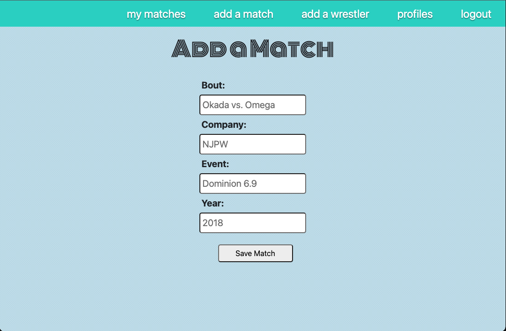
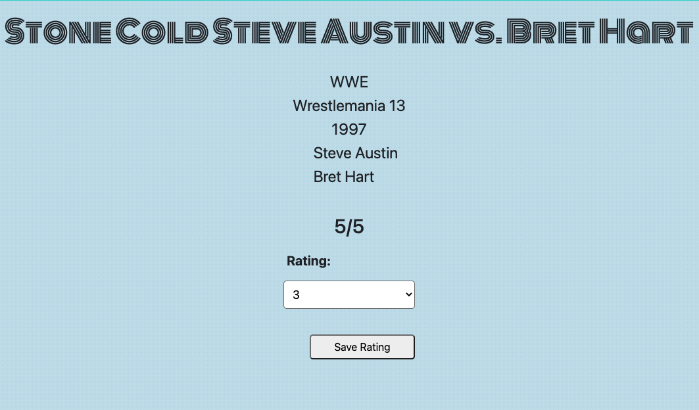

# Matches

Matches is an application where users can log and rate the professional wrestling matches they watch. The url is a tip of the hat to French literary theorist Roland Barthes, and his 1957 essay "The World of Wrestling."

*The virture of all-in wrestling is that it is the spectacle of excess.* -Barthes (*Mythologies*)

Get excessive, rate some matches here: 

https://roland-barthes.herokuapp.com/

## Technologies Used

## Screenshots

## Wireframe
.png)

## Trello 
https://trello.com/b/sRnIO0BE/unit-2-project-matches

## Credits
+ General Assembly e-gen-replacement repo
+ Background via Hero Patterns https://heropatterns.com/
+ Monoton Cursive Font via https://fonts.google.com/specimen/Monoton

